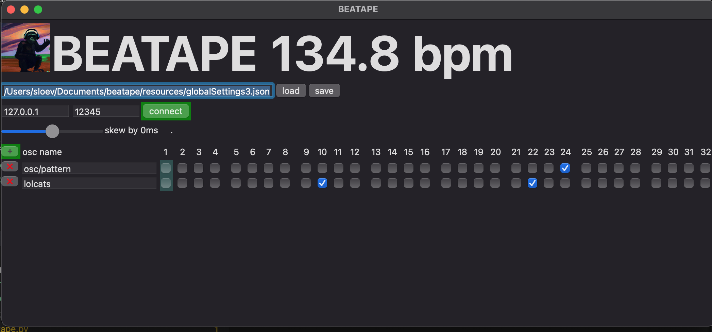

# beatape


# BEATAPE


## requirements:

```
pip>=22.2.2
wheel
packaging
cython>=0.25
mido>=1.2.6
numpy>=1.13.4
scipy>=0.16
aiosc
pyaudio
toga>=0.3.0.dev38
git+https://github.com/CPJKU/madmom#egg=madmom
```


## tested on
osx and python 3.9.2

## screenshot


